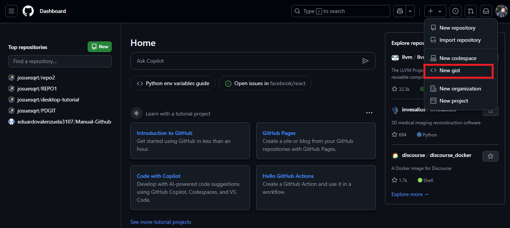

<h1>Gists en Git y Github con Javascript</h1>

<Los gists  proporcionan una manera sencilla de compartir fragmentos de código con otros usuarios. Todo gist es un repositorio Git, lo que significa que se puede bifurcar y clonar. Si has iniciado sesión en GitHub, cuando crees un gist, este se asociará con tu cuenta y lo verás en tu lista de gists cuando te dirijas a tu página principal del gist.

Los gists pueden ser públicos o secretos. Los gists públicos aparecen en Discover, donde los usuarios pueden examinar los nuevos gists a medida que se crean. También se los puede buscar, para que puedas usarlos si deseas que otras personas encuentren tu trabajo y lo vean.

Los gists secretos no aparecen en Discover y no se pueden buscar a menos que haya iniciado sesión y sea el autor del gist secreto. Los gists no son privados. Si envía la dirección URL de un gist secreto a un amigo, podrá verlo. Pero si alguien que no conoces descubre la dirección URL, también podrá ver el gist. Si necesita mantener el código alejado de los ojos indiscretos, es posible que quiera crear un repositorio privado.

Después de crear un gist, no se puede convertir de público a secreto. Sin embargo, un gist secreto se puede hacer público editando el gist y actualizando la visibilidad al público.

 Recibirás una notificación cuando:   

* **Seas el autor de un gist.** 
* **Alguien te mencione en un gist.**
* **Para suscribirse a un gist, haga clic en Subscribe en la parte superior de cualquier gist.**

Puedes fijar los gists a tu perfil para que otras personas los puedan ver fácilmente. Para más información, consulta Anclar elementos a tu perfil.

Puede descubrir gists públicos que hayan creado otros usuarios si vas a página principal del gist y haces clic en Todos los gists. Esto te llevará a una página en la que aparecen todos los gists clasificados y presentados por fecha de creación o actualización. También puedes buscar los gists por idioma con Búsqueda de gists.

Dado que los gists son repositorios Git, puedes ver su historial de confirmaciones completo, que incluye todas las diferencias que existan. También puedes bifurcar o clonar gists. Para más información, consulta Bifurcar y clonar gists.

